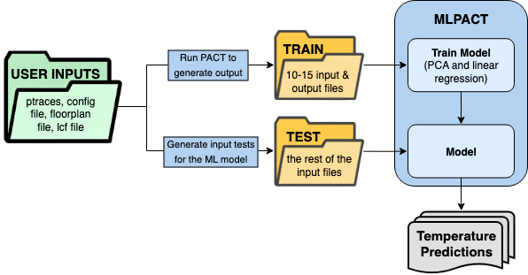

# MLPACT


# Table of Contents

- [Overview](#overview)
- [Installation](#installation)
- [Usage](#usage)
- [Configuration](#configuration)
- [Project Structure](#project-structure)


# Overview

This script runs transient PACT using PCA-based linear regression.


# Installation

Open a new python environment in the terminal. Code must be run in python environment to install and use the necessary modules.


```bash
python3 -m venv <my_env>
```

Activate the environment:

```bash
source my_env/bin/activate
```

Install necessary modules as needed, based on command line error outputs:

```bash
pip install pandas matplotlib numpy scipy torch scikit-learn
```


# Usage

```bash
python MLCAD_MLPACT_main.py --modelParams-file <modelParams_file> --power-data-csv <power_data_csv> --train-dir <train_dir> --test-dir <test_dir> --ground-truth-temp-dir <ground_truth_temp_dir> --ground-truth-avail <ground_truth_avail> --n-components-features <n_components_features> --n-components-targets <n_components_targets> --pred-model 
```

# Configuration

User inputs are as follows: (optional)
1. Model parameter file
    * [PATH] defines the path to the library, ptrace, flp.
    * [Simulation] defines the simulation type (e.g, steady-state or transient).
    * [Solver] selects the solver (SuperLU, SPICE_steady, SPICE_transient).
    * [Grid] is the number of grid cells used in the simulation.
    * Users can also define the heat sink characteristics, cooling properties, and other cooling options.

2. Power data file

3. Training data directory 
    * Directory path to where training files are stored
    * Contains 10 .cir circuit files and 10 .cir.csv ground truth temperature files
    
4. Testing data directory 
    * Directory path to where testing files are stored
    * Contains .cir circuit files different from the ones previously used for testing
    
6. Visualization (default is set to False)
    * Boolean argument to toggle whether to save temperature output as a heat map (True) or a .csv file (False)

7. Number of feature components (default is set to 50)
    * Number of feature components for PCA

8. Number of target components (default is set to 50)
    * Number of target components for PCA
    

# Project Structure

The simulation flow of MLPACT is shown in the following image:



<!--  -->

<!--  -->